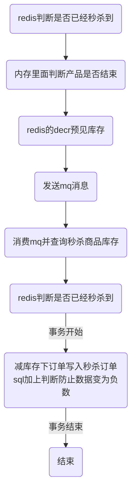

# 系统优化思考
涉及相关知识

## 分布式

### 分布式事务
- TCC事务及相关案例

### 分布式主键生成
#### 基于数据库的自增id
这个就是说你的系统里每次得到一个 id，都是往一个库的一个表里插入一条没什么业务含义的数据，然后获取一个数据库自增的一个 id。拿到这个 id 之后再往对应的分库分表里去写入。
- 优点：方便简单，谁都会用
- 缺点：缺点就是单库生成自增 id，要是高并发的话，就会有瓶颈的。

#### 设置数据库 sequence 或者表自增字段步长
可以通过设置数据库 sequence 或者表的自增字段步长来进行水平伸缩。
比如说，现在有 8 个服务节点，每个服务节点使用一个 sequence 功能来产生 ID，每个 sequence 的起始 ID 不同，并且依次递增，步长都是 8。


#### UUID
好处就是本地生成，不要基于数据库来了；不好之处就是，UUID 太长了、占用空间大，作为主键性能太差了；更重要的是，UUID 不具有有序性，会导致 B+ 树索引在写的时候有过多的随机写操作（连续的 ID 可以产生部分顺序写），还有，由于在写的时候不能产生有顺序的 append 操作，而需要进行 insert 操作，将会读取整个 B+ 树节点到内存，在插入这条记录后会将整个节点写回磁盘，这种操作在记录占用空间比较大的情况下，性能下降明显。
**如果使用文件名称，或者编号适合UUID,但是不适合主键。**

#### 获取系统当前时间
  这个就是获取当前时间即可，但是问题是，并发很高的时候，比如一秒并发几千，会有重复的情况，这个是肯定不合适的。基本就不用考虑了。

#### snowflake 算法
snowflake 算法是 twitter 开源的分布式 id 生成算法，采用 Scala 语言实现，是把一个 64 位的 long 型的 id，1 个 bit 是不用的，用其中的 41 bit 作为毫秒数，用 10 bit 作为工作机器 id，12 bit 作为序列号。
- 1 bit：不用，为啥呢？因为二进制里第一个 bit 为如果是 1，那么都是负数，但是我们生成的 id 都是正数，所以第一个 bit 统一都是 0。
- 41 bit：表示的是时间戳，单位是毫秒。41 bit 可以表示的数字多达 2^41 - 1，也就是可以标识 2^41 - 1 个毫秒值，换算成年就是表示**69年**的时间。
- 10 bit：记录工作机器 id，代表的是这个服务最多可以部署在 2^10台机器上哪，也就是1024台机器。但是 10 bit 里 5 个 bit 代表机房 id，5 个 bit 代表机器 id。意思就是最多代表 2^5个机房（32个机房），每个机房里可以代表 2^5 个机器（32台机器）。
- 12 bit：这个是用来记录同一个毫秒内产生的不同 id，12 bit 可以代表的最大正整数是 2^12 - 1 = 4096，也就是说可以用这个 12 bit 代表的数字来区分同一个毫秒内的 4096 个不同的 id。
snowflake算法的实现：
```java
public class IdWorker {

    private long workerId;
    private long datacenterId;
    private long sequence;

    public IdWorker(long workerId, long datacenterId, long sequence) {
        // sanity check for workerId
        // 这儿不就检查了一下，要求就是你传递进来的机房id和机器id不能超过32，不能小于0
        if (workerId > maxWorkerId || workerId < 0) {
            throw new IllegalArgumentException(
                    String.format("worker Id can't be greater than %d or less than 0", maxWorkerId));
        }
        if (datacenterId > maxDatacenterId || datacenterId < 0) {
            throw new IllegalArgumentException(
                    String.format("datacenter Id can't be greater than %d or less than 0", maxDatacenterId));
        }
        System.out.printf(
                "worker starting. timestamp left shift %d, datacenter id bits %d, worker id bits %d, sequence bits %d, workerid %d",
                timestampLeftShift, datacenterIdBits, workerIdBits, sequenceBits, workerId);

        this.workerId = workerId;
        this.datacenterId = datacenterId;
        this.sequence = sequence;
    }

    private long twepoch = 1288834974657L;

    private long workerIdBits = 5L;
    private long datacenterIdBits = 5L;

    // 这个是二进制运算，就是 5 bit最多只能有31个数字，也就是说机器id最多只能是32以内
    private long maxWorkerId = -1L ^ (-1L << workerIdBits);

    // 这个是一个意思，就是 5 bit最多只能有31个数字，机房id最多只能是32以内
    private long maxDatacenterId = -1L ^ (-1L << datacenterIdBits);
    private long sequenceBits = 12L;

    private long workerIdShift = sequenceBits;
    private long datacenterIdShift = sequenceBits + workerIdBits;
    private long timestampLeftShift = sequenceBits + workerIdBits + datacenterIdBits;
    private long sequenceMask = -1L ^ (-1L << sequenceBits);

    private long lastTimestamp = -1L;

    public long getWorkerId() {
        return workerId;
    }

    public long getDatacenterId() {
        return datacenterId;
    }

    public long getTimestamp() {
        return System.currentTimeMillis();
    }

    public synchronized long nextId() {
        // 这儿就是获取当前时间戳，单位是毫秒
        long timestamp = timeGen();

        if (timestamp < lastTimestamp) {
            System.err.printf("clock is moving backwards.  Rejecting requests until %d.", lastTimestamp);
            throw new RuntimeException(String.format(
                    "Clock moved backwards.  Refusing to generate id for %d milliseconds", lastTimestamp - timestamp));
        }

        if (lastTimestamp == timestamp) {
            // 这个意思是说一个毫秒内最多只能有4096个数字
            // 无论你传递多少进来，这个位运算保证始终就是在4096这个范围内，避免你自己传递个sequence超过了4096这个范围
            sequence = (sequence + 1) & sequenceMask;
            if (sequence == 0) {
                timestamp = tilNextMillis(lastTimestamp);
            }
        } else {
            sequence = 0;
        }

        // 这儿记录一下最近一次生成id的时间戳，单位是毫秒
        lastTimestamp = timestamp;

        // 这儿就是将时间戳左移，放到 41 bit那儿；
        // 将机房 id左移放到 5 bit那儿；
        // 将机器id左移放到5 bit那儿；将序号放最后12 bit；
        // 最后拼接起来成一个 64 bit的二进制数字，转换成 10 进制就是个 long 型
        return ((timestamp - twepoch) << timestampLeftShift) | (datacenterId << datacenterIdShift)
                | (workerId << workerIdShift) | sequence;
    }

    private long tilNextMillis(long lastTimestamp) {
        long timestamp = timeGen();
        while (timestamp <= lastTimestamp) {
            timestamp = timeGen();
        }
        return timestamp;
    }

    private long timeGen() {
        return System.currentTimeMillis();
    }

    // ---------------测试---------------
    public static void main(String[] args) {
        IdWorker worker = new IdWorker(1, 1, 1);
        for (int i = 0; i < 30; i++) {
            System.out.println(worker.nextId());
        }
    }

}

```
### 分布式限流
#### 限流算法
##### 计数器算法
计数器算法的思想很简单，每当一个请求到来时，我们就将计数器加一，当计数器数值超过阈值后，就拒绝余下请求。会有所谓的突刺现象，一秒钟特别忙，另一秒钟特别的闲。


### 分布式锁
#### 用数据库实现分布式锁
- 基于表记录
  当我们想要获得锁的时候，就可以在该表中增加一条记录，想要释放锁的时候就删除这条记录。

```mysql
CREATE TABLE `database_lock` (
	`id` BIGINT NOT NULL AUTO_INCREMENT,
	`resource` int NOT NULL COMMENT '锁定的资源',
	`description` varchar(1024) NOT NULL DEFAULT "" COMMENT '描述',
	PRIMARY KEY (`id`),
	UNIQUE KEY `uiq_idx_resource` (`resource`)
) ENGINE=InnoDB DEFAULT CHARSET=utf8mb4 COMMENT='数据库分布式锁表';
```
当我们想要获得锁时，可以插入一条数据：
```mysql
INSERT INTO database_lock(resource, description) VALUES (1, 'lock');
```
当需要释放锁的时，可以删除这条数据：
```mysql
DELETE FROM database_lock WHERE resource=1;
```
这种实现方式非常的简单，但是需要注意以下几点：
- 这种锁没有失效时间，一旦释放锁的操作失败就会导致锁记录一直在数据库中，其它线程无法获得锁。这个缺陷也很好解决，比如可以做一个定时任务去定时清理。
- 这种锁的可靠性依赖于数据库。建议设置备库，避免单点，进一步提高可靠性。
- 这种锁是非阻塞的，因为插入数据失败之后会直接报错，想要获得锁就需要再次操作。如果需要阻塞式的，可以弄个for循环、while循环之类的，直至INSERT成功再返回。
- 这种锁也是非可重入的，因为同一个线程在没有释放锁之前无法再次获得锁，因为数据库中已经存在同一份记录了。想要实现可重入锁，可以在数据库中添加一些字段，比如获得锁的主机信息、线程信息等，那么在再次获得锁的时候可以先查询数据，如果当前的主机信息和线程信息等能被查到的话，可以直接把锁分配给它。

#### 乐观锁
乐观锁大多数是基于数据版本(version)的记录机制实现的。在更新过程中，会对版本号进行比较，如果是一致的，没有发生改变，则会成功执行本次操作；如果版本号不一致，则会更新失败。
库存模型用下面的一张表optimistic_lock来表述，参考如下：
```mysql
CREATE TABLE `optimistic_lock` (
	`id` BIGINT NOT NULL AUTO_INCREMENT,
	`resource` varchar(64) NOT NULL COMMENT '锁定的资源',
  `resource_num` int NOT NULL COMMENT `资源的库存`,
	`version` int NOT NULL COMMENT '版本信息',
	`created_at` datetime COMMENT '创建时间',
	`updated_at` datetime COMMENT '更新时间',
	`deleted_at` datetime COMMENT '删除时间',
	PRIMARY KEY (`id`),
	UNIQUE KEY `uiq_idx_resource` (`resource`)
) ENGINE=InnoDB DEFAULT CHARSET=utf8mb4 COMMENT='数据库分布式锁表';
```
在使用乐观锁之前要确保表中有相应的数据，比如：
```mysql
INSERT INTO optimistic_lock(resource, resource_num,version, created_at, updated_at) VALUES(20, 1, CURTIME(), CURTIME());
```
操作流程如下：
- STEP1 - 获取资源： SELECT resource, version FROM optimistic_lock WHERE id = 1
- STEP2 - 执行业务逻辑
- STEP3 - 更新资源：UPDATE optimistic_lock SET resource = resource -1, version = version + 1 WHERE id = 1 AND version = oldVersion
我们通过上述sql语句还可以看到，数据库锁都是作用于同一行数据记录上，这就导致一个明显的缺点，在一些特殊场景，如大促、秒杀等活动开展的时候，大量的请求同时请求同一条记录的行锁，会对数据库产生很大的写压力。所以综合数据库乐观锁的优缺点，乐观锁比较适合并发量不高，并且写操作不频繁的场景。

#### 悲观锁
在查询语句后面增加FOR UPDATE，数据库会在查询过程中给数据库表增加悲观锁，也称排他锁。具体步骤如下：
  - STEP1 - 获取锁：SELECT * FROM database_lock WHERE id = 1 FOR UPDATE;。
- STEP2 - 执行业务逻辑。
- STEP3 - 释放锁：COMMIT。
在使用悲观锁的同时，我们需要注意一下锁的级别。MySQL InnoDB引起在加锁的时候，只有明确地指定主键(或索引)的才会执行行锁 (只锁住被选取的数据)，否则MySQL 将会执行表锁(将整个数据表单给锁住)。
缺点很明显，即每次请求都会额外产生加锁的开销且未获取到锁的请求将会阻塞等待锁的获取，在高并发环境下，容易造成大量请求阻塞，影响系统可用性。另外，悲观锁使用不当还可能产生死锁的情况。
####基于数据库实现分布式锁的缺点
- 锁没有失效时间,一旦解锁操作失败,就会导致锁记录一直在数据库中,其他线程无法再获得到锁
- 锁是非阻塞的,数据的insert操作,一旦插入失败就会直接报错。没有获得锁的线程并不会进入排队队列
  要想再次获得锁就要再次触发获得锁操作
- 锁是非重入的,同一个线程在没有释放锁之前无法再次获得该锁

#### 用zk实现分布式锁
假如当前有一个父节点为/lock,我们可以在这个父节点下面创建子节；zookeeper提供了一个可选的有序特性
例如我们可以创建子节点“/lock/node-”并且指明有序,那么zookeeper在生成子节点时会根据当前的子节点数量自动添加整数序号
也就是说如果是第一个创建的子节点,那么生成的子节点为/lock/node-0000000000,下一个节点则为/lock/node-0000000001,依次类推

临时节点：客户端可以建立一个临时节点,在会话结束或者会话超时后,zookeeper会自动删除该节点

事件监听：在读取数据时,我们可以同时对节点设置事件监听,当节点数据或结构变化时,zookeeper会通知客户端
当前zookeeper有如下四种事件：
1）节点创建
2）节点删除
3）节点数据修改
4）子节点变更

获取分布式锁的流程  ------- 假设所空间的根节点为/lock

1.客户端连接zookeeper,并在/lock下创建临时的且有序的子节点
第一个客户端对应的子节点为/lock/lock-0000000000,第二个为/lock/lock-0000000001,以此类推

2.--避免羊群效应--客户端获取/lock下的子节点列表,判断自己创建的子节点是否为当前子节点列表中序号最小的子节点,
如果是则认为获得锁,否则监听刚好在自己之前一位的子节点删除消息,获得子节点变更通知后重复此步骤直至获得锁

3.实行业务代码

4.流程完成后,删除对应的子节点并释放锁  （Watch机制）
对应分布式开源包Curator,就是使用分布式锁实现的基于zookeeper分布式锁

#### 使用redis实现分布式锁
一般是使用 setnx(set if not exists) 指令，只允许被一个客户端占坑。先来先占， 用完了，再调用 del 指令释放茅坑。
```java
// 这里的冒号:就是一个普通的字符，没特别含义，它可以是任意其它字符，不要误解
> setnx lock:codehole true
OK
... do something critical ...
> del lock:codehole
(integer) 1
```
##### 问题1-超时问题
超时问题,通过设计超时时间，随机版本号，lua脚本保证匹配删除问题的原子性操作；
##### 问题2-可重入性
基于ThreadLocal 和引用计数保证可重入性
##### 问题3-集群failover
  主节点挂掉时，从节点会取而代之，客户端上却并没有明显感知。原先第一个客户端在主节点中申请成功了一把锁，但是这把锁还没有来得及同步到从节点，主节点突然挂掉了。然后从节点变成了主节点，这个新的节点内部没有这个锁，所以当另一个客户端过来请求加锁时，立即就批准了。这样就会导致系统中同样一把锁被两个客户端同时持有，不安全性由此产生。
加锁时，它会向过半节点发送 set(key, value, nx=True, ex=xxx) 指令，只要过半节点 set 成功，那就认为加锁成功。释放锁时，需要向所有节点发送 del 指令。不过 Redlock 算法还需要考虑出错重试、时钟漂移等很多细节问题，同时因为 Redlock 需要向多个节点进行读写，意味着相比单实例 Redis 性能会下降一些。
##### redlock使用场景
如果你很在乎高可用性，希望挂了一台 redis 完全不受影响，那就应该考虑 redlock。不过代价也是有的，需要更多的 redis 实例，性能也下降了，代码上还需要引入额外的 library，运维上也需要特殊对待，这些都是需要考虑的成本，使用前请再三斟酌。
redlock流程，为了取到锁，客户端应该执行以下操作:
  - 获取当前Unix时间，以毫秒为单位。
  - 依次尝试从5个实例，使用相同的key和具有唯一性的value（例如UUID）获取锁。当向Redis请求获取锁时，客户端应该设置一个网络连接和响应超时时间，这个超时时间应该小于锁的失效时间。例如你的锁自动失效时间为10秒，则超时时间应该在5-50毫秒之间。这样可以避免服务器端Redis已经挂掉的情况下，客户端还在死死地等待响应结果。如果服务器端没有在规定时间内响应，客户端应该尽快尝试去另外一个Redis实例请求获取锁。
  - 客户端使用当前时间减去开始获取锁时间（步骤1记录的时间）就得到获取锁使用的时间。当且仅当从大多数（N/2+1，这里是3个节点）的Redis节点都取到锁，并且使用的时间小于锁失效时间时，锁才算获取成功。
  - 如果取到了锁，key的真正有效时间等于有效时间减去获取锁所使用的时间（步骤3计算的结果）。
  - 如果因为某些原因，获取锁失败（没有在至少N/2+1个Redis实例取到锁或者取锁时间已经超过了有效时间），客户端应该在所有的Redis实例上进行解锁（即便某些Redis实例根本就没有加锁成功，防止某些节点获取到锁但是客户端没有得到响应而导致接下来的一段时间不能被重新获取锁）。

  redis分布式锁的发展


[马丁·科勒普曼关于redlock的分析](http://martin.kleppmann.com/2016/02/08/how-to-do-distributed-locking.html) 中介绍redlock是一个严格要求时序性的算法
扩展
- jvm的stw

## 数据库mysql
### 事务相关
#### 事务的特性
事务的特性ACID,原子性，一致性，隔离性，持久性。
- 原子性：整个数据库事务是不可分割的工作单位。只有使事务中所有的数据库操作执行都成功，才算整个事务成功。
- 一致性：主要指数据库从一种一致性状态到达另一种一致性状态。
- 隔离性：一个事务的影响在该事务提交之前对其他事务不可见。--通过锁来实现。
举个例子，现实中两次转账是应该是不会相互影响的，比如A账户向B账户转账两次，每次都转账5元，那么最后一定是A账户少10元，B账户多10元。假设两次转账操作分别对应为T1和T2,如何两次转账是顺序操作的，那么如下图所示，

但是，T1和T2可能交错执行

这样转账就发生了问题。所以数据库的设计要保障其他的状态转换不应该影响本次的状态转换，这个规则称之为隔离性。
- 持久性：事务一旦提交，其结果就是永久的。即使发生宕机等故障，数据库也能将数据恢复。
其中，隔离性由锁机制实现，原子性，一致性和持久性由redo和undo日志来完成。


#### 事务的隔离级别
因为事务是具有隔离性的，理论上某个事务对某个数据进行访问时，其他的事务应该进行排队，在事务提交后，其他事务才能继续访问这条数据，但是这样的话对性能的影响太大。


##### 事务并发的时候可能会遇到的问题
事务在不保证串行的情况下可能出现的问题。
1.脏写
当两个事务同时尝试去更新某一条数据记录时，就肯定会存在一个先一个后。而当事务A更新时，事务A还没提交，事务B就也过来进行更新，覆盖了事务A提交的更新数据，这就是脏写。
2.脏读
如果一个事务A向数据库写了数据，但事务还没提交或终止，另一个事务B就看到了事务A写进数据库的数据，这就是脏读。
3.不可重复读
如果一个事务只能读到另一个已经提交的事务修改过的数据，并且其他事务每对该数据进行一次修改并提交后，该事务都能查询得到最新值，那就意味着发生了不可重复读，实例如下图所示：

4.幻读
如果一个事务先根据某些条件查询出一些记录，之后另一个事务又向表中插入了符合这些条件的记录，原先的事务再次按照该条件查询时，能把另一个事务插入的记录也读出来，那就意味着发生了幻读，示意图如下：

问题的严重性排序：脏写 > 脏读 > 不可重复读 > 幻读


##### 事务的隔离等级
我们上边所说的舍弃一部分隔离性来换取一部分性能在这里就体现在：设立一些隔离级别，隔离级别越低，越严重的问题就越可能发生。
读未提交，读已提交，可重复读，可串行化
SQL标准中规定，针对不同的隔离级别，并发事务可以发生不同严重程度的问题，具体情况如下：
| 隔离级别 | 脏读 | 不可重读读 | 幻读 |
| ------ | ------ | ------ | ------ |
| 读未提交 | Possible | Possible | Possible |
| 读已提交 | Not Possible | Possible | Possible |
| 可重复读 | Not Possible | Not Possible | Possible |
| 串行化 | Not Possible | Not Possible | Not Possible |

##### 事务隔离等级实现的方式
为什么有了事务这东西，还需要乐观锁悲观锁？事务是粗粒度的概念、乐观锁悲观锁可以更细粒度的控制；
比如抢票，假设余票只有1张；隔离级别可以保证事务A和事务B不能读到对方的数据，也不能更新对方正在更新的数据，但是事务A和事务B都认为还有1张余票，于是出票，并更新为0；
事务解决了并发问题，已经不存在并发问题了；
但是事务B读取的是过时数据，依据过时数据做了业务处理；
所以需要乐观锁或者悲观锁，来记录一个信息：当前已经读取的数据，是不是已经过时了！
事务有这么几种实现方式：锁协议、MVCC、时间戳排序协议、有效性检查协议，锁协议是事务的一种实现方式，事务 = 用锁封装的一个函数，可以重用而已，但是这几个事务的函数覆盖面太粗粒度了，所以有时候我们还得借助于锁来进行细粒度控制；
事务不能保证每个操作结果正确，售票时超卖还是会发生。
事务保证整个操作的成一个组，要么全做要么全不做 但是不能保证多个事务同时读取同一个数据
数据对象被加上排它锁时，其他的事务不能对它读取和修改；加了共享锁的数据对象可以被其他事务读取，但不能修改
事务可以用锁实现，可以保证一致性和隔离性，但是锁用来保证并发性；
隔离性和并发性有点类似，但是隔离性只是保证不会出现相互读取中间数据，却无法解决并发的问题

#### redo日志
[参考链接](https://juejin.im/post/5c3c5c0451882525487c498d)
##### redo log 概述
重做日志用来实现事务的持久性，即ACID中的D，由两部分组成：
- 一是内存中的重做日志缓冲(redo log buffer)  易丢失
- 二是重做日志文件(redo log file) 持久的
InnoDB是事务的存储引擎，其通过Force Log at Commit 机制实现事务的持久性，即当事务提交commit时，必须先将事务的所有日志写入到重做日志文件进行持久化，待事务COMMIT操作完成才算完成。

##### redo log 流程
redo的整体流程，以更新事务为例，redo log的流转流程如下图所示

1.先将原始数据从磁盘读到内存中，修改数据的内存拷贝；
2.生成一条重做日志并写入redo log buffer,记录的是数据被修改后的值；
3.当事务commit时，将redo log buffer中的内容刷到redo log file,对redo log file 采用追加写的方式；
4.定期将内存中修改的数据率新到磁盘中；

##### redo日志的作用
主要作用是用于数据的崩溃恢复

##### redo日志的写入时机
- log buffer空间不够时
- 事务提交时
- 后台线程不停的刷盘
- 正常关闭服务器时


#### undo日志
##### undo日志的概念
undo log主要记录的是数据的逻辑变化，为了在发生错误时回滚之前的操作，需要将之前的操作都记录下来，然后在发生错误时才可以回滚。

##### undo log的作用
undo是一种逻辑日志，有两个作用：
- 事务回滚
- mvcc
undo日志用于事务的回滚操作进而保障了事务的原子性。需要注意的是，undo页面的修改，同样需要记录redo日志。

### 分库分表
[相关介绍](https://github.com/Meituan-Dianping/Zebra/wiki/Zebra%E8%AF%BB%E5%86%99%E5%88%86%E7%A6%BB%E4%BB%8B%E7%BB%8D)
当读压力太大，单台mysql实例扛不住时，此时DBA一般会将数据库配置成集群，一个master(主库)，多个slave(从库)，master将数据通过binlog的方式同步给slave，可以将slave节点的数据理解为master节点数据的全量备份。
### mysql主从同步方式
主从同步采用复制的方式，是Mysql数据库提供的一种高可用高性能的解决方案，一般用建立大型的应用。整体来说，复制的工作原理分为一下的三个步骤：
- 主服务器把数据更改记录到二进制日志（binglog）中。
- 从服务器把主服务器的二进制日志复制到自己的中继日志中。
- 从服务器重做中继日志中的日志，把更改应用到自己的数据库上，以达到数据的最终一致性。
从服务器有两个线程，一个是I/O线程，负责读取主服务上的二进制日志，并将其保存为中继日志；另一个是SQL线程，复制执行中继日志。
主从复制流程如下：


#### 半同步复制
用来解决主库数据丢失的问题；主库写入binlog日志之后，就会将强制此时立即将数据同步到从库，从库将日志写入自己本地的 relay log 之后，接着会返回一个 ack 给主库，主库接收到至少一个从库的 ack 之后才会认为写操作完成了。

#### 并行复制
用来解决主从同步延时的问题，指的是从库开启多个线程，并行读取 relay log 中不同库的日志，然后并行重放不同库的日志，这是库级别的并行。（前提是进行了分库）

一般来说，如果主从延迟较为严重，有以下解决方案：
- 分库，将一个主库拆分为多个主库，每个主库的写并发就减少了几倍，此时主从延迟可以忽略不计。
- 打开 MySQL 支持的并行复制，多个库并行复制。如果说某个库的写入并发就是特别高，单库写并发达到了 2000/s，并行复制还是没意义。
- 重写代码，写代码的同学，要慎重，插入数据时立马查询可能查不到。
- 如果确实是存在必须先插入，立马要求就查询到，然后立马就要反过来执行一些操作，对这个查询设置直连主库。不推荐这种方法，你要是这么搞，读写分离的意义就丧失了。

高并发的场景下回出现严重的主从不一致。要解决这个问题，要将上面的sql线程拆分成多个线程处理，

coordinate对应这原来的 sql线程，具体执行binlog复制的是worker,分发策略的原则是
- 不能造成更新覆盖，同一行的更新必须被分发到同一个worker中
- 同一个事务不能被被拆开，必须被分配到同一个worker中
[具体的分发策略](https://www.jianshu.com/p/a7c7d5c42417)


## 秒杀场景的解决方案
- 在sql加上判断防止数据变为负数
- 数据库加唯一索引防止用户重复购买
- redis预减库存减少数据库访问　内存标记减少redis访问　请求先入队列缓冲，异步下单，增强用户体验


### 整体流程解决方案


## 中间件解决方案
### Redis
#### rehash
  [渐进式 rehash 策略](http://redisbook.com/preview/dict/incremental_rehashing.html):为了避免 rehash 对服务器性能造成影响， 服务器不是一次性将 ht[0] 里面的所有键值对全部 rehash 到 ht[1] ， 而是分多次、渐进式地将 ht[0] 里面的键值对慢慢地 rehash 到 ht[1] 。
##### rehash 的详细步骤：
- 为 ht[1] 分配空间， 让字典同时持有 ht[0] 和 ht[1] 两个哈希表。
- 在字典中维持一个索引计数器变量 rehashidx ， 并将它的值设置为 0 ， 表示 rehash 工作正式开始。
- 在 rehash 进行期间， 每次对字典执行添加、删除、查找或者更新操作时， 程序除了执行指定的操作以外， 还会顺带将 ht[0] 哈希表在 rehashidx 索引上的所有键值对 rehash 到 ht[1] ， 当 rehash 工作完成之后， 程序将 rehashidx 属性的值增一。
- 随着字典操作的不断执行， 最终在某个时间点上， ht[0] 的所有键值对都会被 rehash 至 ht[1] ， 这时程序将 rehashidx 属性的值设为 -1 ， 表示 rehash 操作已完成。

##### 触发扩容的条件
- 如果哈希表ht[0]中保存的key个数与哈希表大小的比例已经达到1:1，即保存的节点数已经大于哈希表大小，且redis服务当前允许执行rehash
- 或者保存的节点数与哈希表大小的比例超过了安全阈值（默认值为5）
则将哈希表大小扩容为原来的两倍
- [redis渐进式rehash机制](https://luoming1224.github.io/2018/11/12/[redis%E5%AD%A6%E4%B9%A0%E7%AC%94%E8%AE%B0]redis%E6%B8%90%E8%BF%9B%E5%BC%8Frehash%E6%9C%BA%E5%88%B6/)

##### redis的java客户端jedis
[jedis实例是非线程安全的](https://www.jianshu.com/p/5e4a1f92c88f),常常通过JedisPool连接池去管理实例，在多线程情况下让每个线程有自己独立的jedis实例。Redis所有单个命令的执行都是原子性的，这与它的单线程机制有关；
jedi实例不是线程安全的原因：
