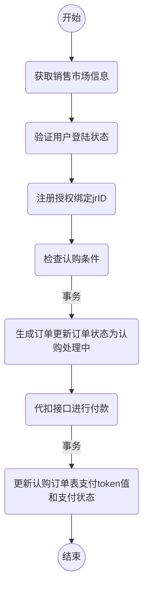

## 功能介绍
  功能包括：外部渠道如银行+项目管理，订单管理，信息查询等功能，下单，赎回等；

  外部渠道：银行+
    1.查询指定销售渠道、指定银行渠道、指定会员的交易记录；
    2.询指定销售渠道、指定银行渠道、指定会员的持仓记录；
    3.认购订单接口（下单并支付）

### 下单认购功能

##场景问题解决及优化
1.如何解决卖超问题
- 在sql加上判断防止数据边为负数
- 数据库加唯一索引防止用户重复购买
- redis预减库存减少数据库访问　内存标记减少redis访问　请求先入队列缓冲，异步下单，增强用户体验

# 风控：
## 系统介绍
- 反欺诈
  1.决策引擎：
  **智策系统**：
    a.策略配置；
    b.单元测试；
    c.发布打包；
  **天策系统**
    a.接口管理：（1）普通接口；（2）策略接口（可以执行智策的打包控制版本，回滚，执行存储）；
    b.数据管理： （1）应用表； （2）扩展数据（食蚁兽，资信平台，机器学习）
    c.决策流（服务编排，把编排后的整体作为api对外提供服务）

  **食蚁兽**：
  通过类sql的形式获取数据；基于redis实现的；

  **洞察**：

  **资信平台**：
  接口字段适配；缓存既查得数据；

  2.实时计算引擎：
  3.策略管理平台：
  4.洞察：监控报警
  5.名单系统：黑白名单，内外数据
  6.资信平台：接口管理
  7.智能平台：身份校验，一天内登陆，设备指纹，
  8.催收
  9.人审
  10.案件

- 信用
  1.决策
  2.实时
  3.策略管理
  4.洞察
  5.名单
  6.资信平台

  业务层

智能决策平台 d
