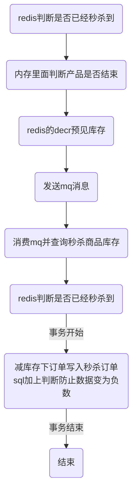

# 系统优化思考
涉及相关知识
## 分布式事务解决方案
- TCC事务及相关案例


## 分布式限流解决方案
### 限流算法
#### 计数器算法
计数器算法的思想很简单，每当一个请求到来时，我们就将计数器加一，当计数器数值超过阈值后，就拒绝余下请求。会有所谓的突刺现象，一秒钟特别忙，另一秒钟特别的闲。

## 分布式锁解决方案
#### 用数据库实现分布式锁
- 基于表记录
  当我们想要获得锁的时候，就可以在该表中增加一条记录，想要释放锁的时候就删除这条记录。

```mysql
CREATE TABLE `database_lock` (
	`id` BIGINT NOT NULL AUTO_INCREMENT,
	`resource` int NOT NULL COMMENT '锁定的资源',
	`description` varchar(1024) NOT NULL DEFAULT "" COMMENT '描述',
	PRIMARY KEY (`id`),
	UNIQUE KEY `uiq_idx_resource` (`resource`)
) ENGINE=InnoDB DEFAULT CHARSET=utf8mb4 COMMENT='数据库分布式锁表';
```
当我们想要获得锁时，可以插入一条数据：
```mysql
INSERT INTO database_lock(resource, description) VALUES (1, 'lock');
```
当需要释放锁的时，可以删除这条数据：
```mysql
DELETE FROM database_lock WHERE resource=1;
```
这种实现方式非常的简单，但是需要注意以下几点：
- 这种锁没有失效时间，一旦释放锁的操作失败就会导致锁记录一直在数据库中，其它线程无法获得锁。这个缺陷也很好解决，比如可以做一个定时任务去定时清理。
- 这种锁的可靠性依赖于数据库。建议设置备库，避免单点，进一步提高可靠性。
- 这种锁是非阻塞的，因为插入数据失败之后会直接报错，想要获得锁就需要再次操作。如果需要阻塞式的，可以弄个for循环、while循环之类的，直至INSERT成功再返回。
- 这种锁也是非可重入的，因为同一个线程在没有释放锁之前无法再次获得锁，因为数据库中已经存在同一份记录了。想要实现可重入锁，可以在数据库中添加一些字段，比如获得锁的主机信息、线程信息等，那么在再次获得锁的时候可以先查询数据，如果当前的主机信息和线程信息等能被查到的话，可以直接把锁分配给它。

#### 乐观锁
乐观锁大多数是基于数据版本(version)的记录机制实现的。在更新过程中，会对版本号进行比较，如果是一致的，没有发生改变，则会成功执行本次操作；如果版本号不一致，则会更新失败。
库存模型用下面的一张表optimistic_lock来表述，参考如下：
```mysql
CREATE TABLE `optimistic_lock` (
	`id` BIGINT NOT NULL AUTO_INCREMENT,
	`resource` varchar(64) NOT NULL COMMENT '锁定的资源',
  `resource_num` int NOT NULL COMMENT `资源的库存`,
	`version` int NOT NULL COMMENT '版本信息',
	`created_at` datetime COMMENT '创建时间',
	`updated_at` datetime COMMENT '更新时间',
	`deleted_at` datetime COMMENT '删除时间',
	PRIMARY KEY (`id`),
	UNIQUE KEY `uiq_idx_resource` (`resource`)
) ENGINE=InnoDB DEFAULT CHARSET=utf8mb4 COMMENT='数据库分布式锁表';
```
在使用乐观锁之前要确保表中有相应的数据，比如：
```mysql
INSERT INTO optimistic_lock(resource, resource_num,version, created_at, updated_at) VALUES(20, 1, CURTIME(), CURTIME());
```
操作流程如下：
- STEP1 - 获取资源： SELECT resource, version FROM optimistic_lock WHERE id = 1
- STEP2 - 执行业务逻辑
- STEP3 - 更新资源：UPDATE optimistic_lock SET resource = resource -1, version = version + 1 WHERE id = 1 AND version = oldVersion
我们通过上述sql语句还可以看到，数据库锁都是作用于同一行数据记录上，这就导致一个明显的缺点，在一些特殊场景，如大促、秒杀等活动开展的时候，大量的请求同时请求同一条记录的行锁，会对数据库产生很大的写压力。所以综合数据库乐观锁的优缺点，乐观锁比较适合并发量不高，并且写操作不频繁的场景。

#### 悲观锁
在查询语句后面增加FOR UPDATE，数据库会在查询过程中给数据库表增加悲观锁，也称排他锁。具体步骤如下：
  - STEP1 - 获取锁：SELECT * FROM database_lock WHERE id = 1 FOR UPDATE;。
- STEP2 - 执行业务逻辑。
- STEP3 - 释放锁：COMMIT。
在使用悲观锁的同时，我们需要注意一下锁的级别。MySQL InnoDB引起在加锁的时候，只有明确地指定主键(或索引)的才会执行行锁 (只锁住被选取的数据)，否则MySQL 将会执行表锁(将整个数据表单给锁住)。
缺点很明显，即每次请求都会额外产生加锁的开销且未获取到锁的请求将会阻塞等待锁的获取，在高并发环境下，容易造成大量请求阻塞，影响系统可用性。另外，悲观锁使用不当还可能产生死锁的情况。
####基于数据库实现分布式锁的缺点
- 锁没有失效时间,一旦解锁操作失败,就会导致锁记录一直在数据库中,其他线程无法再获得到锁
- 锁是非阻塞的,数据的insert操作,一旦插入失败就会直接报错。没有获得锁的线程并不会进入排队队列
  要想再次获得锁就要再次触发获得锁操作
- 锁是非重入的,同一个线程在没有释放锁之前无法再次获得该锁

#### 用zk实现分布式锁
假如当前有一个父节点为/lock,我们可以在这个父节点下面创建子节；zookeeper提供了一个可选的有序特性
例如我们可以创建子节点“/lock/node-”并且指明有序,那么zookeeper在生成子节点时会根据当前的子节点数量自动添加整数序号
也就是说如果是第一个创建的子节点,那么生成的子节点为/lock/node-0000000000,下一个节点则为/lock/node-0000000001,依次类推

临时节点：客户端可以建立一个临时节点,在会话结束或者会话超时后,zookeeper会自动删除该节点

事件监听：在读取数据时,我们可以同时对节点设置事件监听,当节点数据或结构变化时,zookeeper会通知客户端
当前zookeeper有如下四种事件：
1）节点创建
2）节点删除
3）节点数据修改
4）子节点变更

获取分布式锁的流程  ------- 假设所空间的根节点为/lock

1.客户端连接zookeeper,并在/lock下创建临时的且有序的子节点
第一个客户端对应的子节点为/lock/lock-0000000000,第二个为/lock/lock-0000000001,以此类推

2.--避免羊群效应--客户端获取/lock下的子节点列表,判断自己创建的子节点是否为当前子节点列表中序号最小的子节点,
如果是则认为获得锁,否则监听刚好在自己之前一位的子节点删除消息,获得子节点变更通知后重复此步骤直至获得锁

3.实行业务代码

4.流程完成后,删除对应的子节点并释放锁  （Watch机制）
对应分布式开源包Curator,就是使用分布式锁实现的基于zookeeper分布式锁

#### 使用redis实现分布式锁
一般是使用 setnx(set if not exists) 指令，只允许被一个客户端占坑。先来先占， 用完了，再调用 del 指令释放茅坑。
```java
// 这里的冒号:就是一个普通的字符，没特别含义，它可以是任意其它字符，不要误解
> setnx lock:codehole true
OK
... do something critical ...
> del lock:codehole
(integer) 1
```
##### 问题1-超时问题
超时问题,通过设计超时时间，随机版本号，lua脚本保证匹配删除问题的原子性操作；
##### 问题2-可重入性
基于ThreadLocal 和引用计数保证可重入性
##### 问题3-集群failover
  主节点挂掉时，从节点会取而代之，客户端上却并没有明显感知。原先第一个客户端在主节点中申请成功了一把锁，但是这把锁还没有来得及同步到从节点，主节点突然挂掉了。然后从节点变成了主节点，这个新的节点内部没有这个锁，所以当另一个客户端过来请求加锁时，立即就批准了。这样就会导致系统中同样一把锁被两个客户端同时持有，不安全性由此产生。
加锁时，它会向过半节点发送 set(key, value, nx=True, ex=xxx) 指令，只要过半节点 set 成功，那就认为加锁成功。释放锁时，需要向所有节点发送 del 指令。不过 Redlock 算法还需要考虑出错重试、时钟漂移等很多细节问题，同时因为 Redlock 需要向多个节点进行读写，意味着相比单实例 Redis 性能会下降一些。
##### redlock使用场景
如果你很在乎高可用性，希望挂了一台 redis 完全不受影响，那就应该考虑 redlock。不过代价也是有的，需要更多的 redis 实例，性能也下降了，代码上还需要引入额外的 library，运维上也需要特殊对待，这些都是需要考虑的成本，使用前请再三斟酌。
redlock流程，为了取到锁，客户端应该执行以下操作:
  - 获取当前Unix时间，以毫秒为单位。
  - 依次尝试从5个实例，使用相同的key和具有唯一性的value（例如UUID）获取锁。当向Redis请求获取锁时，客户端应该设置一个网络连接和响应超时时间，这个超时时间应该小于锁的失效时间。例如你的锁自动失效时间为10秒，则超时时间应该在5-50毫秒之间。这样可以避免服务器端Redis已经挂掉的情况下，客户端还在死死地等待响应结果。如果服务器端没有在规定时间内响应，客户端应该尽快尝试去另外一个Redis实例请求获取锁。
  - 客户端使用当前时间减去开始获取锁时间（步骤1记录的时间）就得到获取锁使用的时间。当且仅当从大多数（N/2+1，这里是3个节点）的Redis节点都取到锁，并且使用的时间小于锁失效时间时，锁才算获取成功。
  - 如果取到了锁，key的真正有效时间等于有效时间减去获取锁所使用的时间（步骤3计算的结果）。
  - 如果因为某些原因，获取锁失败（没有在至少N/2+1个Redis实例取到锁或者取锁时间已经超过了有效时间），客户端应该在所有的Redis实例上进行解锁（即便某些Redis实例根本就没有加锁成功，防止某些节点获取到锁但是客户端没有得到响应而导致接下来的一段时间不能被重新获取锁）。

  redis分布式锁的发展


[马丁·科勒普曼关于redlock的分析](http://martin.kleppmann.com/2016/02/08/how-to-do-distributed-locking.html) 中介绍redlock是一个严格要求时序性的算法
扩展
- jvm的stw

## 秒杀场景的解决方案
- 在sql加上判断防止数据变为负数
- 数据库加唯一索引防止用户重复购买
- redis预减库存减少数据库访问　内存标记减少redis访问　请求先入队列缓冲，异步下单，增强用户体验
### 整体流程解决方案


## 中间件解决方案
### Redis
#### rehash
  [渐进式 rehash 策略](http://redisbook.com/preview/dict/incremental_rehashing.html):为了避免 rehash 对服务器性能造成影响， 服务器不是一次性将 ht[0] 里面的所有键值对全部 rehash 到 ht[1] ， 而是分多次、渐进式地将 ht[0] 里面的键值对慢慢地 rehash 到 ht[1] 。
##### rehash 的详细步骤：
- 为 ht[1] 分配空间， 让字典同时持有 ht[0] 和 ht[1] 两个哈希表。
- 在字典中维持一个索引计数器变量 rehashidx ， 并将它的值设置为 0 ， 表示 rehash 工作正式开始。
- 在 rehash 进行期间， 每次对字典执行添加、删除、查找或者更新操作时， 程序除了执行指定的操作以外， 还会顺带将 ht[0] 哈希表在 rehashidx 索引上的所有键值对 rehash 到 ht[1] ， 当 rehash 工作完成之后， 程序将 rehashidx 属性的值增一。
- 随着字典操作的不断执行， 最终在某个时间点上， ht[0] 的所有键值对都会被 rehash 至 ht[1] ， 这时程序将 rehashidx 属性的值设为 -1 ， 表示 rehash 操作已完成。

##### 触发扩容的条件
- 如果哈希表ht[0]中保存的key个数与哈希表大小的比例已经达到1:1，即保存的节点数已经大于哈希表大小，且redis服务当前允许执行rehash
- 或者保存的节点数与哈希表大小的比例超过了安全阈值（默认值为5）
则将哈希表大小扩容为原来的两倍
- [redis渐进式rehash机制](https://luoming1224.github.io/2018/11/12/[redis%E5%AD%A6%E4%B9%A0%E7%AC%94%E8%AE%B0]redis%E6%B8%90%E8%BF%9B%E5%BC%8Frehash%E6%9C%BA%E5%88%B6/)

##### redis的java客户端jedis
[jedis实例是非线程安全的](https://www.jianshu.com/p/5e4a1f92c88f),常常通过JedisPool连接池去管理实例，在多线程情况下让每个线程有自己独立的jedis实例。Redis所有单个命令的执行都是原子性的，这与它的单线程机制有关；
jedi实例不是线程安全的原因：

#####

## 网络解决方案
### org.apache.http.NoHttpResponseException:ip : port failed to respond
产生的原因肯可能有两种
- 当服务器端由于负载过大等情况发生时，可能会导致在收到请求后无法处理(比如没有足够的线程资源)，会直接丢弃链接而不进行处理。此时客户端就回报错：NoHttpResponseException。 建议出现这种情况时，可以选择重试。
- 同一个线程的多个请求可以复用同一个长连接。客户端使用长链接的时候，服务端已经关闭了该连接，导致出现NoHttpResponseException。解决的放哪可以.
1. http请求使用重发机制，捕获NohttpResponseException的异常，重新发送请求，重发3次后还是失败才停止。由于不知道客户端捕获到NohttpResponseException这个异常后，客户端是否自动关闭了这个连接，每次重发都需要新建连接发送。新建连接不存在太长的空闲时间问题，因此能够通过重发解决交易失败的问题。
2. 我方系统主动检查每个连接的空闲时间，允许设置连接的最大空闲时间M，即客户端建立的连接空闲M秒后，自动发起断开连接。只要这个M时间小于服务端的最大空闲时间，将完全避免服务端主动断开连接导致的异常。
[apache——http文档](http://hc.apache.org/httpcomponents-client-ga/tutorial/html/connmgmt.html#d5e659)
