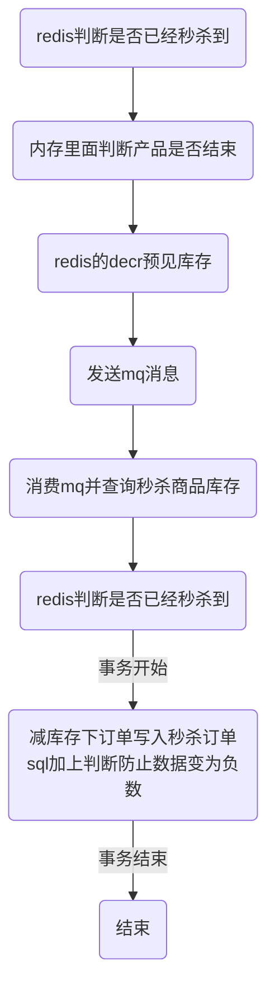

- [1. 事务相关](#1-事务相关)
    - [1.1. 事务的特性](#11-事务的特性)
    - [1.2. 事务的隔离级别](#12-事务的隔离级别)
        - [1.2.1. 事务并发的时候可能会遇到的问题](#121-事务并发的时候可能会遇到的问题)
        - [1.2.2. 事务的隔离等级](#122-事务的隔离等级)
        - [1.2.3. 事务隔离等级实现的方式](#123-事务隔离等级实现的方式)
    - [1.3. redo日志](#13-redo日志)
        - [1.3.1. redo log 概述](#131-redo-log-概述)
        - [1.3.2. redo log 流程](#132-redo-log-流程)
        - [1.3.3. redo日志的作用](#133-redo日志的作用)
        - [1.3.4. redo日志的写入时机](#134-redo日志的写入时机)
    - [1.4. undo日志](#14-undo日志)
        - [1.4.1. undo日志的概念](#141-undo日志的概念)
        - [1.4.2. undo log的作用](#142-undo-log的作用)
- [2. 分库分表](#2-分库分表)
- [3. mysql主从同步方式](#3-mysql主从同步方式)
    - [3.1. 半同步复制](#31-半同步复制)
    - [3.2. 并行复制](#32-并行复制)
- [4. 秒杀场景的解决方案](#4-秒杀场景的解决方案)
    - [4.1. 整体流程解决方案](#41-整体流程解决方案)

# 1. 事务相关
## 1.1. 事务的特性
事务的特性ACID,原子性，一致性，隔离性，持久性。
- 原子性：整个数据库事务是不可分割的工作单位。只有使事务中所有的数据库操作执行都成功，才算整个事务成功。
- 一致性：主要指数据库从一种一致性状态到达另一种一致性状态。
- 隔离性：一个事务的影响在该事务提交之前对其他事务不可见。--通过锁来实现。
举个例子，现实中两次转账是应该是不会相互影响的，比如A账户向B账户转账两次，每次都转账5元，那么最后一定是A账户少10元，B账户多10元。假设两次转账操作分别对应为T1和T2,如何两次转账是顺序操作的，那么如下图所示，

但是，T1和T2可能交错执行

这样转账就发生了问题。所以数据库的设计要保障其他的状态转换不应该影响本次的状态转换，这个规则称之为隔离性。
- 持久性：事务一旦提交，其结果就是永久的。即使发生宕机等故障，数据库也能将数据恢复。
其中，隔离性由锁机制实现，原子性，一致性和持久性由redo和undo日志来完成。

## 1.2. 事务的隔离级别
因为事务是具有隔离性的，理论上某个事务对某个数据进行访问时，其他的事务应该进行排队，在事务提交后，其他事务才能继续访问这条数据，但是这样的话对性能的影响太大。

### 1.2.1. 事务并发的时候可能会遇到的问题
事务在不保证串行的情况下可能出现的问题。
1.脏写
当两个事务同时尝试去更新某一条数据记录时，就肯定会存在一个先一个后。而当事务A更新时，事务A还没提交，事务B就也过来进行更新，覆盖了事务A提交的更新数据，这就是脏写。
2.脏读
如果一个事务A向数据库写了数据，但事务还没提交或终止，另一个事务B就看到了事务A写进数据库的数据，这就是脏读。
3.不可重复读
如果一个事务只能读到另一个已经提交的事务修改过的数据，并且其他事务每对该数据进行一次修改并提交后，该事务都能查询得到最新值，那就意味着发生了不可重复读，实例如下图所示：

4.幻读
如果一个事务先根据某些条件查询出一些记录，之后另一个事务又向表中插入了符合这些条件的记录，原先的事务再次按照该条件查询时，能把另一个事务插入的记录也读出来，那就意味着发生了幻读，示意图如下：

问题的严重性排序：脏写 > 脏读 > 不可重复读 > 幻读

### 1.2.2. 事务的隔离等级
我们上边所说的舍弃一部分隔离性来换取一部分性能在这里就体现在：设立一些隔离级别，隔离级别越低，越严重的问题就越可能发生。
读未提交，读已提交，可重复读，可串行化
SQL标准中规定，针对不同的隔离级别，并发事务可以发生不同严重程度的问题，具体情况如下：
| 隔离级别 | 脏读 | 不可重读读 | 幻读 |
| ------ | ------ | ------ | ------ |
| 读未提交 | Possible | Possible | Possible |
| 读已提交 | Not Possible | Possible | Possible |
| 可重复读 | Not Possible | Not Possible | Possible |
| 串行化 | Not Possible | Not Possible | Not Possible |

### 1.2.3. 事务隔离等级实现的方式
为什么有了事务这东西，还需要乐观锁悲观锁？事务是粗粒度的概念、乐观锁悲观锁可以更细粒度的控制；
比如抢票，假设余票只有1张；隔离级别可以保证事务A和事务B不能读到对方的数据，也不能更新对方正在更新的数据，但是事务A和事务B都认为还有1张余票，于是出票，并更新为0；
事务解决了并发问题，已经不存在并发问题了；
但是事务B读取的是过时数据，依据过时数据做了业务处理；
所以需要乐观锁或者悲观锁，来记录一个信息：当前已经读取的数据，是不是已经过时了！
事务有这么几种实现方式：锁协议、MVCC、时间戳排序协议、有效性检查协议，锁协议是事务的一种实现方式，事务 = 用锁封装的一个函数，可以重用而已，但是这几个事务的函数覆盖面太粗粒度了，所以有时候我们还得借助于锁来进行细粒度控制；
事务不能保证每个操作结果正确，售票时超卖还是会发生。
事务保证整个操作的成一个组，要么全做要么全不做 但是不能保证多个事务同时读取同一个数据
数据对象被加上排它锁时，其他的事务不能对它读取和修改；加了共享锁的数据对象可以被其他事务读取，但不能修改
事务可以用锁实现，可以保证一致性和隔离性，但是锁用来保证并发性；
隔离性和并发性有点类似，但是隔离性只是保证不会出现相互读取中间数据，却无法解决并发的问题

## 1.3. redo日志
[参考链接](https://juejin.im/post/5c3c5c0451882525487c498d)
### 1.3.1. redo log 概述
重做日志用来实现事务的持久性，即ACID中的D，由两部分组成：
- 一是内存中的重做日志缓冲(redo log buffer)  易丢失
- 二是重做日志文件(redo log file) 持久的
InnoDB是事务的存储引擎，其通过Force Log at Commit 机制实现事务的持久性，即当事务提交commit时，必须先将事务的所有日志写入到重做日志文件进行持久化，待事务COMMIT操作完成才算完成。

### 1.3.2. redo log 流程
redo的整体流程，以更新事务为例，redo log的流转流程如下图所示

1.先将原始数据从磁盘读到内存中，修改数据的内存拷贝；
2.生成一条重做日志并写入redo log buffer,记录的是数据被修改后的值；
3.当事务commit时，将redo log buffer中的内容刷到redo log file,对redo log file 采用追加写的方式；
4.定期将内存中修改的数据率新到磁盘中；

### 1.3.3. redo日志的作用
主要作用是用于数据的崩溃恢复

### 1.3.4. redo日志的写入时机
- log buffer空间不够时
- 事务提交时
- 后台线程不停的刷盘
- 正常关闭服务器时

## 1.4. undo日志
### 1.4.1. undo日志的概念
undo log主要记录的是数据的逻辑变化，为了在发生错误时回滚之前的操作，需要将之前的操作都记录下来，然后在发生错误时才可以回滚。

### 1.4.2. undo log的作用
undo是一种逻辑日志，有两个作用：
- 事务回滚
- mvcc
undo日志用于事务的回滚操作进而保障了事务的原子性。需要注意的是，undo页面的修改，同样需要记录redo日志。

# 2. 分库分表
[相关介绍](https://github.com/Meituan-Dianping/Zebra/wiki/Zebra%E8%AF%BB%E5%86%99%E5%88%86%E7%A6%BB%E4%BB%8B%E7%BB%8D)
当读压力太大，单台mysql实例扛不住时，此时DBA一般会将数据库配置成集群，一个master(主库)，多个slave(从库)，master将数据通过binlog的方式同步给slave，可以将slave节点的数据理解为master节点数据的全量备份。
# 3. mysql主从同步方式
主从同步采用复制的方式，是Mysql数据库提供的一种高可用高性能的解决方案，一般用建立大型的应用。整体来说，复制的工作原理分为一下的三个步骤：
- 主服务器把数据更改记录到二进制日志（binglog）中。
- 从服务器把主服务器的二进制日志复制到自己的中继日志中。
- 从服务器重做中继日志中的日志，把更改应用到自己的数据库上，以达到数据的最终一致性。
从服务器有两个线程，一个是I/O线程，负责读取主服务上的二进制日志，并将其保存为中继日志；另一个是SQL线程，复制执行中继日志。
主从复制流程如下：

## 3.1. 半同步复制
用来解决主库数据丢失的问题；主库写入binlog日志之后，就会将强制此时立即将数据同步到从库，从库将日志写入自己本地的 relay log 之后，接着会返回一个 ack 给主库，主库接收到至少一个从库的 ack 之后才会认为写操作完成了。

## 3.2. 并行复制
用来解决主从同步延时的问题，指的是从库开启多个线程，并行读取 relay log 中不同库的日志，然后并行重放不同库的日志，这是库级别的并行。（前提是进行了分库）

一般来说，如果主从延迟较为严重，有以下解决方案：
- 分库，将一个主库拆分为多个主库，每个主库的写并发就减少了几倍，此时主从延迟可以忽略不计。
- 打开 MySQL 支持的并行复制，多个库并行复制。如果说某个库的写入并发就是特别高，单库写并发达到了 2000/s，并行复制还是没意义。
- 重写代码，写代码的同学，要慎重，插入数据时立马查询可能查不到。
- 如果确实是存在必须先插入，立马要求就查询到，然后立马就要反过来执行一些操作，对这个查询设置直连主库。不推荐这种方法，你要是这么搞，读写分离的意义就丧失了。

高并发的场景下回出现严重的主从不一致。要解决这个问题，要将上面的sql线程拆分成多个线程处理，

coordinate对应这原来的 sql线程，具体执行binlog复制的是worker,分发策略的原则是
- 不能造成更新覆盖，同一行的更新必须被分发到同一个worker中
- 同一个事务不能被被拆开，必须被分配到同一个worker中
[具体的分发策略](https://www.jianshu.com/p/a7c7d5c42417)

# 4. 秒杀场景的解决方案
- 在sql加上判断防止数据变为负数
- 数据库加唯一索引防止用户重复购买
- redis预减库存减少数据库访问　内存标记减少redis访问　请求先入队列缓冲，异步下单，增强用户体验

## 4.1. 整体流程解决方案
